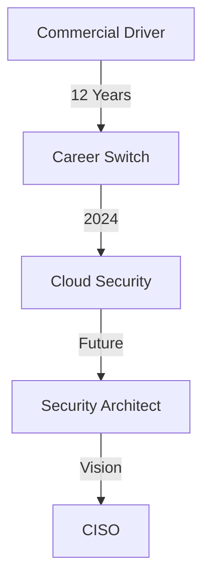

## 🤠👋 Howdy there, I'm iWreckn! 👋🤠


I'm ~~on my way to becoming~~ a **Cloud Security Engineer** 🚀. My path from **commercial truck driving** 🚛 to **cloud security** shows that with determination, career transitions are possible! I found my passion in creating secure cloud solutions.

## 🛠 What I Do

### Cloud Security & Infrastructure
- Specialize in **Azure**, **GCP**, and **private cloud** environments 🌥️
- Develop and enforce security policies across **Azure Policy**, **Hashicorp Sentinel**, **Prisma Cloud**, and native cloud services 🛡️
- Build secure test environments using **Terraform** **ARM Templates** and automation scripts 🧱
- Manage **Kubernetes** runtime policies for cloud-native workloads 🔒

## 📚 Current Focus

I'm constantly learning and growing in the cloud security space:
- Enhancing my **Python** skills for security automation 🐍
- Diving deep into **Docker**, **Kubernetes**, and **CI/CD** practices 🔄
- Pursuing WGU's **Cloud Computing Bachelor's** (Azure track) 📘

## 🧰 Tech Stack

```text
Cloud Platforms    │ Azure, GCP, Private Cloud
Security Tools     │ Prisma Cloud, Azure Sentinel, Splunk>
Infrastructure     │ Terraform, Docker, Kubernetes
Programming        │ Python, Bash, JavaScript 
Networking         │ Traditional IT & Cloud Networking
```

## 🎯 Career Journey



## 🌟 Fun Facts

- 🚛 Transitioned from **12 years as a truck driver** to cloud security!
- 🎤 Recently presented at a **NIST conference**, & recognized by Google Grow with Me team over career transition.
- 📸 Photography enthusiast and comedy lover
- 👨‍👦 Proud dad raising a future hacker!


## 🤝 Let's Connect!

[](https://www.linkedin.com/in/james-minhinnett-824550238/)

### 📈 Recent Activity

<!--START_SECTION:activity-->
<!-- This section can be updated automatically using GitHub Actions -->
<!--END_SECTION:activity-->

---
<p align="center">
  <i>"Stay curious, stay humble, and always stay hacking!"</i> 💻
</p>
